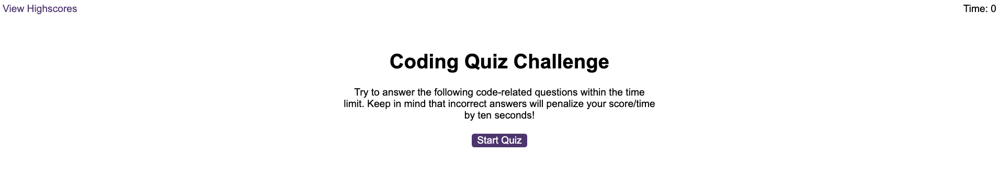

# Code-Quiz

## Description

This JavaScript Quiz Game is an application designed to test users knowledge on Javascript. The quiz consists of 5 multiple choice questions related to JavaScript topics. The quiz is timed, with the time being deducted for each wrong answer.

The quiz also includes a pop-up message that notifies user if the answer is correct or wrong, along with different audio being played for correct or wrong answers to provide an engaging experience.

The game features a leaderboard that allows user to save their initials with their score, which are stored in local storage for future reference. The leaderboard is also sorted in descending order of scores, making it easy to see users progress.

In addition, the game has a clear local storage button, making it easy for user to erase the previous scores and start fresh.

## Features

- Multiple choice questions with 4 possible answers.
- Timer that challenges user to complete the quiz in a specified time.
- Time deducted for each wrong answer.
- User is notified if answer is correct or wrong by a pop-up message.
- Different audio is played depending on the answer being correct or wrong.
- Display of a score at the end of the quiz.
- High score storage with option to add initials using local storage.
- Stored scores are displayed in a leaderboard-style format, in a desceding order.
- Easy clearing of Local Storage with just one click of a button.

## Technologies Used

- HTML 5: 

- CSS:

- JavaScript:

## Installation

N/A

## Usage

View the completed project below on the deployed link. A screenshot has also been added.

[Link to the finished deployed website](https://aboltins.github.io/code-quiz)

Things to note : 

Initials are purposely set to only take values of letters a-z/A-Z and . , / and up to 4 characters.

## Credits

N/A

## License

Please refer to the LICENSE in the repo.

---

## Badges

